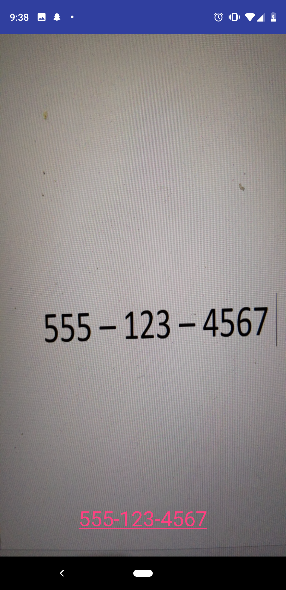
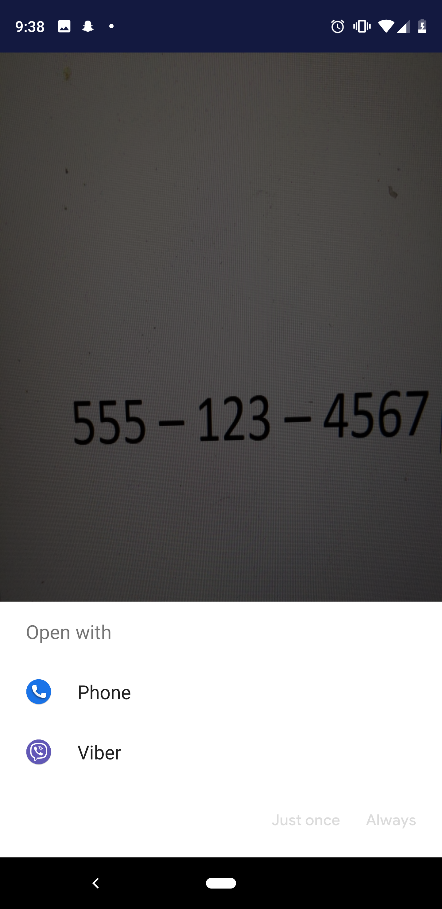

# Scan2Go 

  

Scan2Go is a simple application that uses the device camera to convert external text into to text dynamically displayed on device screen, distinguishing between phone numbers, emails, and website links.

Hovering the camera over a 10 or 11 digit phone number, the camera will automatically detect a phone number and open the phone app immediately if your phone app is the only application that can open 10 or 11 digit numbers, or a list of applications to open with if you have more apps that can open 10/11 digit numbers.

A website link that includes "http://" or "www." with an ending of ".com" will automatically detect that it is a website and directly open the link to your web browser.

Tapping over an email address will automatically open your email application or if you have more than one email application - will suggest which app you would like to open this email address with.

The purpose of this application is to make it easier to simply scan information rather than physically needing any utensils, papers, or manually needing to write down such information instead, just scan the information present and decide what to do with it through suggestions. 

## Email Address Sample

  
   

# Phone Number Sample

 
 

# URL Link Sample

 
 

