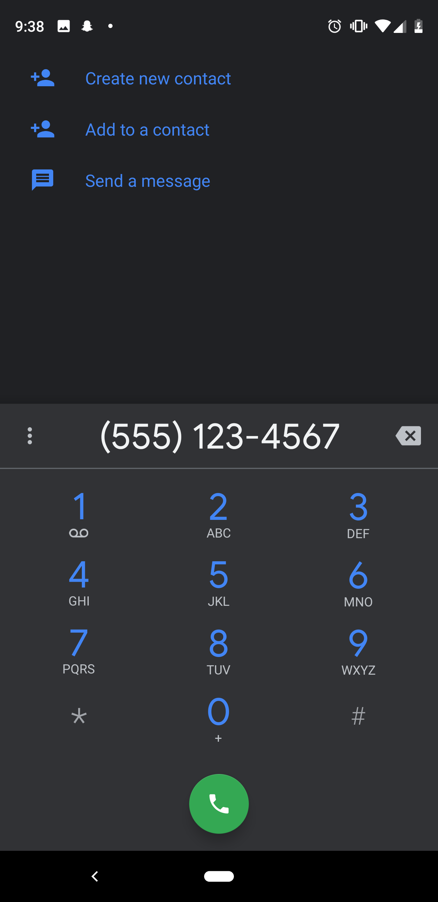
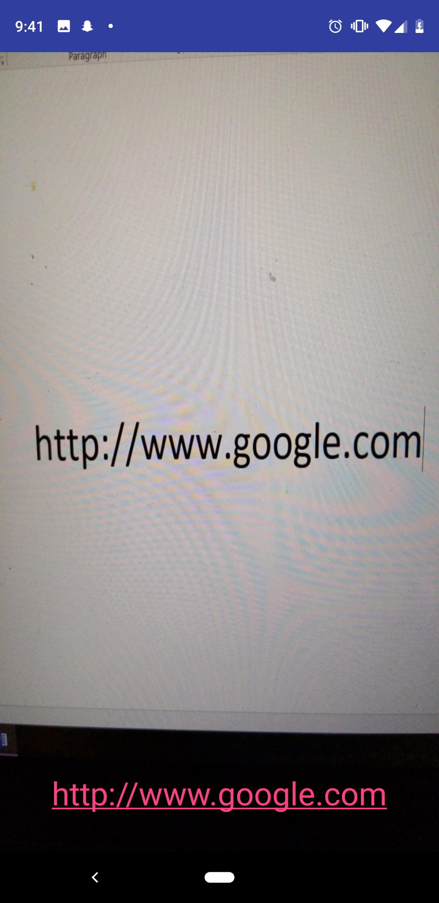

# Scan2Go 

  

Scan2Go is a simple application that uses the device camera to convert external text into to text dynamically displayed on device screen, distinguishing between phone numbers, emails, and website links using OCR capabilities automatically suggesting a list of applications to open with.

The purpose of this application is to make it easier to simply scan information rather than physically needing manual intervention to record information and instead, scan the information in front of you and decide what to do through suggestions. 

## Phone Number

 
 

## Website URL

 
 

